# tish-ide-panels

Reusable [Lattish](https://github.com/tishlang/lattish) IDE panels **and** a full embeddable sandbox-IDE shell for in-browser Tish tooling. Shared as the single source of truth across [`tish-playground`](https://github.com/tishlang/tish), [`tish-learn`](https://github.com/tishlang/tish-learn), and the Tauri-based [`tish-ide`](https://github.com/tishlang/tish-ide). **Pure Tish, zero JS dependencies.**

> Package name is intentionally unscoped (`tish-ide-panels`, not `@tishlang/...`) because the Tish compiler reserves `@tishlang/*` for native Rust modules. Same pattern as the [`lattish`](https://www.npmjs.com/package/lattish) package.

## What's in here

| Export | Purpose |
|---|---|
| `SandboxIde` | The full shell: header + files + editor + terminal + web preview + layout splits + persistence + hotkeys + open-in-new-window. Same component, `mode="full"` or `mode="embed"`. |
| `mountSandboxIde(root, props)` | Convenience: `createRoot(root).render(() => SandboxIde(props))`. |
| `StandalonePage` | The page mounted by SandboxIde's "Open in new window" target. Reads files from `sessionStorage` keyed by `sid`, opens a `BroadcastChannel` for two-way edit sync, then mounts a `mode="full"` `SandboxIde`. |
| `mountStandalonePage(root, props?)` | Convenience mounter for the standalone surface. |
| `EditorPanel` | Textarea + syntax-highlighted overlay, undo/redo (⌘Z / ⇧⌘Z), Tab indent, ⌘D duplicate, ⌘⇧K delete, ⌘/ comment toggle |
| `TerminalPanel` | Console output `<pre>`, `appendLine` / `clear` API |
| `WebPreviewPanel` | Iframe + console-message bridge for JS-target output |
| `FileBrowserPanel` | Simple file list with click-to-select |
| `MiniRunner` | The "beginner widget" — editor + Run button + output diff strip; no terminal/preview chrome |
| `TishHighlight.highlightToHtml(src, path)` | Tish/JSX/CSS tokenizer → spans with `hl-*` classes |
| `useGlobalKeydown(handlers)` | ⌘S / ⌘↵ / ⌘1-4 / Tab cycling for the shell |
| `useResize(bodyRef, layout, setLayout, save)` | Mouse-drag split layout |
| `runVm`, `compileToJsWithRuntime`, `runJsInIframe`, `runCompileAndExec` | Browser-side compile + run helpers (require the wasm-bindgen globals — see below) |
| `writeSandboxSession`, `readSandboxSession`, `parseSandboxSid`, `openSandboxBroadcast` | Open-in-new-window protocol primitives. Most embedders won't touch these directly — `SandboxIde` and `StandalonePage` use them internally. |
| `encodeSharePayload`, `decodeSharePayload`, `parseShareFromUrl`, `readShareFromLocation`, `buildShareUrl`, `isEmbedRequested` | Codepen-style share-by-URL primitives. `SandboxIde` calls them when `enableShare` is on; hosts that want their own UI can call them directly. |

## Host page requirements

The runtime helpers depend on globals exposed by the host page. The simplest setup is the same as [tish-playground](https://github.com/tishlang/tish/blob/main/tish-playground/public/index.html):

```html
<script type="module">
  window.__tishDecodeB64 = (b64) => Uint8Array.from(atob(b64), c => c.charCodeAt(0))

  import vmInit, { run } from "./dist/tish_vm.js"
  await vmInit()
  window.__tishVmRunCaptured = (chunk) => {
    const lines = []
    const orig = console.log
    console.log = (...a) => { lines.push(a.map(String).join(" ")); orig.apply(console, a) }
    try { run(chunk) } catch (e) { lines.push("Runtime: " + e) } finally { console.log = orig }
    return lines
  }

  import compilerInit, {
    compile_to_bytecode_with_imports,
    compile_to_js_with_imports
  } from "./dist/tish_compiler.js"
  await compilerInit()
  window.__tishCompileToBytecodeWithImports = compile_to_bytecode_with_imports
  window.__tishCompileToJsWithImports = compile_to_js_with_imports

  await import("./dist/your-app.js")
</script>
```

`/dist/lattish-runtime.js` should be the output of `tish build app/web-runtime.tish -o public/dist/lattish-runtime.js --target js` for any iframe-based JS preview.

## Styling

Either:

- Link `src/panels.css` directly (drop-in dark theme matching tishlang.com), **or**
- Use [tish-tailwind](https://github.com/tishlang/tish-tailwind) utility classes — the panels emit `pg-*` and `hl-*` class names that map cleanly to a tailwind config.

## Example

```tish
import { createRoot, useRef } from "lattish"
import {
  EditorPanel, TerminalPanel,
  runCompileAndExec
} from "tish-ide-panels"

fn App() {
  let editorApi = useRef(null)
  let terminalApi = useRef(null)
  let runId = useRef(0)

  fn run() {
    let files = [{ path: "main.tish", text: editorApi.current.getContent() }]
    runCompileAndExec({
      files: files, entryPath: "main.tish", webPreview: false,
      terminal: terminalApi.current, runIdRef: runId
    })
  }

  return <div>
    {EditorPanel(editorApi, "console.log(\"hello\")", "main.tish", null, null)}
    <button onclick={run}>{"Run"}</button>
    {TerminalPanel(terminalApi)}
  </div>
}

createRoot(document.body).render(App)
```

See `example/` for a full working setup.

## `SandboxIde` — the full embeddable shell

For most consumers the right entry point isn't the individual panels but `SandboxIde`, which wires them all together with header chrome, layout splits, persistence, hotkeys, the postMessage console bridge, and an "Open in new window" affordance. The same component drives the standalone playground page, the inline `:::sandbox` directive in lessons, and the embeddable side panel inside the Tauri IDE.

```tish
import { mountSandboxIde } from "tish-ide-panels"

mountSandboxIde(document.getElementById("app"), {
  files: [
    { path: "main.tish", text: "console.log('Hello, Tish!')\n" },
    { path: "lib.tish",  text: "// secondary buffer\n" }
  ],
  entryPath: "main.tish",
  kind: "ide",                // "ide" → web preview iframe; "console" → console only
  mode: "full",                // "embed" trims the header to a thin toolbar
  storageKey: "my-app",        // namespaces layout / files / editor-config in localStorage; null disables persistence
  cssEntryPath: "web-preview.css",
  enableNewWindow: true,       // show the ↗ button
})
```

### Props

| Prop | Default | Notes |
|---|---|---|
| `files` | required | Array of `{ path, text }` |
| `entryPath` | `"main.tish"` | File to compile/run |
| `kind` | `"ide"` | `"ide"` adds the web-preview iframe; `"console"` is editor + terminal only |
| `mode` | `"full"` | `"embed"` for in-page mounts (lessons, side panels), `"full"` for standalone pages |
| `storageKey` | `"tish-playground"` | Prefix for layout / files / editor-config keys; `null` disables persistence |
| `cssEntryPath` | `null` | Optional path of a `.css` file in `files` whose text is injected into the iframe head |
| `tabPaths` | `null` | Override the editor-chrome tab list; defaults to the `files` paths in input order |
| `showLayoutPresets` | `mode === "full"` | Show / Editor / Output / Stacked preset buttons |
| `showWebPreviewToggle` | `mode === "full" && kind === "ide"` | "Lattish DOM" toggle to flip JS preview vs console-only VM mode |
| `enableNewWindow` | `false` | Adds the "⇱ New window" button |
| `onOpenNewWindow` | `null` | `({ url, sid, payload }) => true|void` — Tauri hosts override this to open a `WebviewWindow` instead of `window.open` |
| `newWindowUrl` | `"/sandbox"` | URL the default opener navigates to |
| `enableShare` | `false` | Adds **↗ Share** / **⌬ Embed** buttons (and **⑂ Fork** when viewing a shared URL) |
| `shareBaseUrl` | `null` | Base URL the Share/Embed buttons hang the `#share=…` payload off; defaults to `${origin}${pathname}` of the host page |
| `loadShareFromUrl` | `true` | On mount, look for `#share=…` in `location.hash` (or `?share=…` in the search) and rehydrate the sandbox from it. While share-loaded, persistence to localStorage is suppressed until Fork. |
| `apiRef` | `null` | Filled with `{ getFiles, setFiles, run, focus, getCurrentPath, setCurrentPath, shareUrl, embedUrl, fork, isShareLoaded }` |
| `title` | `"Tish playground"` | Shown in the full-mode header |

## Open-in-new-window protocol

The same component is used in the embedder and in the popup. Two channels carry state across the window boundary:

1. **`sessionStorage["tish-sandbox::<sid>"]`** holds the JSON payload `{ files, entryPath, kind, cssEntryPath, openerId, title }`. The standalone page rehydrates from this on load.
2. **`BroadcastChannel("tish-sandbox::<sid>")`** carries `{ type: "files", peerId, files }` messages so edits flow both ways. Each side stamps its own `peerId` and ignores echoes.

Default popup: `window.open(newWindowUrl + "#sid=<sid>", "_blank", "popup=true,width=1200,height=800")`.

Override: pass `onOpenNewWindow` and the embedder takes over. Return `true` to suppress the default `window.open()`. Tauri hosts use this to call `WebviewWindow.create()` against a `sandbox.html` route that mounts `StandalonePage`.

```tish
import { mountStandalonePage } from "tish-ide-panels"

// On the page reached by `newWindowUrl#sid=<sid>`:
mountStandalonePage(document.getElementById("app"), {
  defaultFiles: [{ path: "main.tish", text: "// new\n" }]
})
```

`mountStandalonePage` reads the `sid` from `location.hash` (`#sid=…`) by default; you can also pass `sid` explicitly via props. When the sid is present, it pulls the payload from `sessionStorage` and joins the matching `BroadcastChannel`. When absent, it mounts a fresh sandbox using `defaultFiles`.

## Share-by-URL (codepen-style)

When `enableShare` is on, the SandboxIde header gains three buttons that turn it into a CodePen-shaped sharing surface — **with no backend**.

```mermaid
flowchart LR
  Editor["You edit files in SandboxIde"] -->|click ↗ Share| Encode["encodeSharePayload(files,…)"]
  Encode -->|URL-safe base64| URL["{origin}{pathname}#share=eyJ2…"]
  URL -->|paste / send / iframe| Visitor[Anyone's browser]
  Visitor -->|on mount: readShareFromLocation| Decode["decodeSharePayload(b64)"]
  Decode --> Mount["SandboxIde rehydrates files"]
  Mount -->|click ⑂ Fork| Local["clears URL + saves to localStorage"]
```



**Wire format** — payload is JSON, then URL-safe base64 of the UTF-8 bytes:

```json
{ "v": 1, "files": [{"path": "main.tish", "text": "…"}], "entryPath": "main.tish", "kind": "ide", "cssEntryPath": null, "title": null }
```

No compression yet (keeps the codec sync + dependency-free); payloads up to ~5KB stay well under URL length limits in every modern browser. Bump `v` if you ever change the schema.

**Embed mode** — the **⌬ Embed** button copies an `<iframe>` snippet pointed at the same URL with `?embed=1` appended. SandboxIde checks `isEmbedRequested()` on mount; embedders can choose `mode="embed"` based on it.

```html
<iframe
  src="https://your-site.example/sandbox?embed=1#share=eyJ2…"
  style="width:100%;height:480px;border:1px solid #ccc;border-radius:6px"
  sandbox="allow-scripts allow-same-origin"></iframe>
```

**Fork** — when SandboxIde is viewing a `#share=…` URL, all writes to localStorage are suppressed (so a visitor never quietly clobbers their own pen with a stranger's). Clicking ⑂ Fork flips share-mode off, persists the current state, and clears the hash with `history.replaceState`.

**Programmatic API** — hosts wanting a custom UI can wire `apiRef` to the same primitives:

```tish
let api = useRef(null)
SandboxIde({ files: …, enableShare: false, apiRef: api })

// Later:
let url = api.current.shareUrl()        // → "{origin}{pathname}#share=…"
let iframe = api.current.embedUrl()     // → "{origin}{pathname}?embed=1#share=…"
api.current.fork()                       // claim a share-loaded sandbox
api.current.isShareLoaded()              // true while viewing #share=…
```

## Embedding inside a non-Tish host (Tauri / TypeScript)

Hosts that aren't pure-Tish (e.g. the Tauri+Monaco IDE in `tish-ide`) compile a tiny re-export entry — `import { mountSandboxIde, mountStandalonePage } from "tish-ide-panels"` — into JS via `tish build --target js`, then import the result from TypeScript. The package ships a ready-made entry at `tish-ide-panels/standalone-entry` for this; the host's build pipeline targets that file. See `tish-ide/scripts/append-sandbox-export.mjs` and `tish-ide/apps/tauri-ide/src/sandbox.tish` for a worked example.
